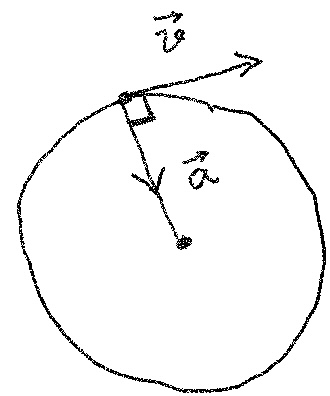
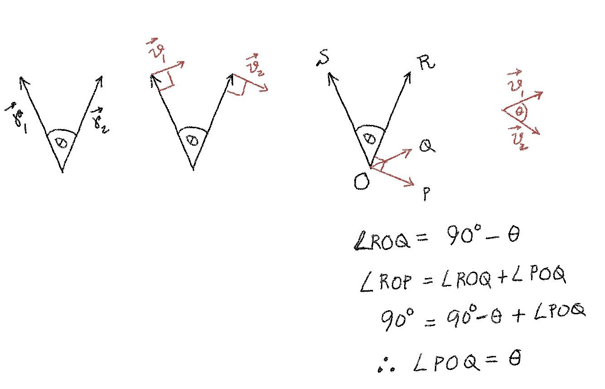
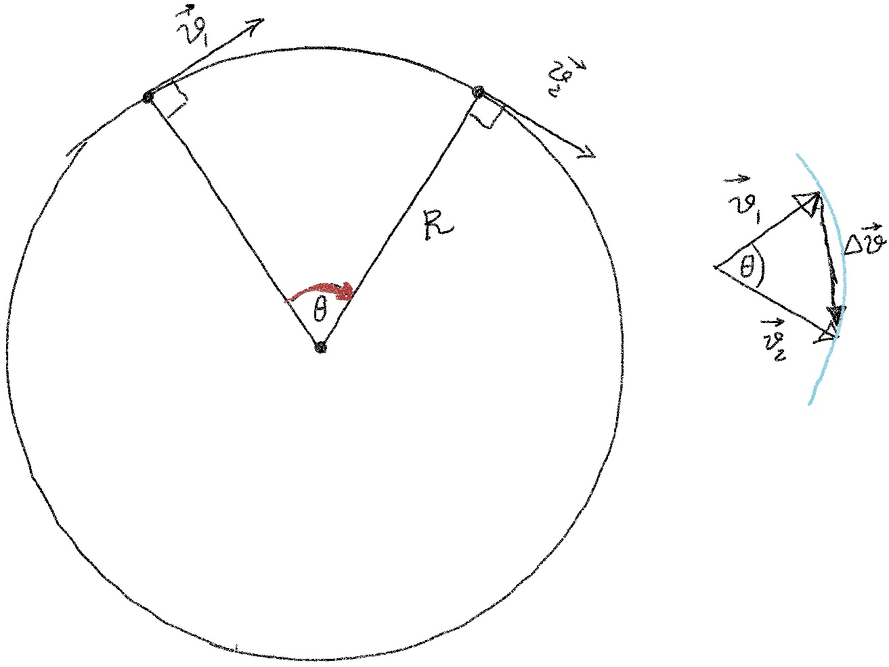
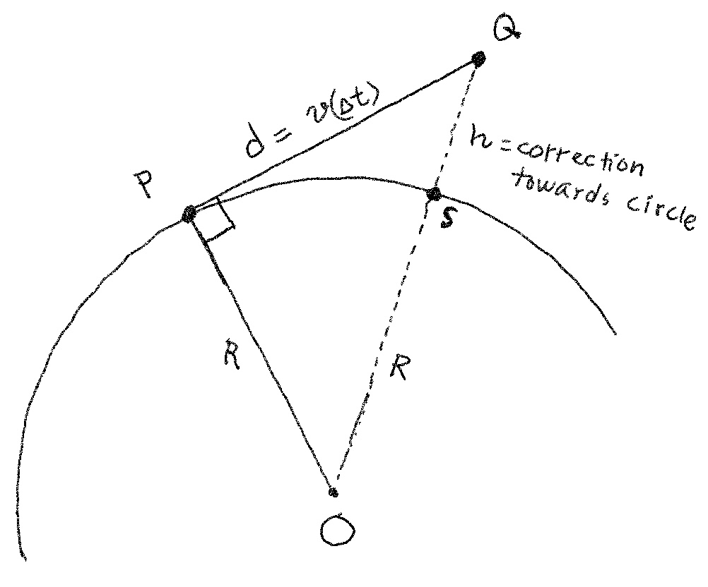
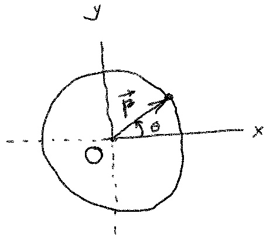

To understand how acceleration affects velocity, it is useful to think of acceleration vector having just two components: one parallel to the velocity vector and the other perpendicular to the velocity vector. The parallel component explains changes in speed and the perpendicular component explains changes in direction.

{width=30% fig-align="center"}

In uniform circular motion, the speed is constant. So, the entire acceleration vector consists of the perpendicular component. At a given point on the circle, the velocity vector is tangent to the circular path and the acceleration vector is directed towards the center along a radius. 

We want to find the magnitude of this acceleration vector.

## Approach 1: Geometric Derivation

$$
\begin{align}
\left| \vec{a}_{average} \right| &= \frac{\left| \Delta \vec{v} \right|}{\Delta t} \\
\left|\vec{a}\right| &= \lim_{\Delta t \to 0} \left| \vec{a}_{average} \right|
\end{align}
$$

First, we shall find out how $\left| \vec{a}_{average} \right|$ looks like geometrically and then we shall reason how the geometric view changes when $\Delta t \to 0$.

We make the below observation about vectors in general: if we have two vectors ($\vec{v}_1$ and $\vec{v}_2$) perpendicular to two other vectors ($\vec{r}_1$ and $\vec{r}_2$), then these two pairs of vectors have same angle ($\theta$) between them. 

{width=100% fig-align="center"}

Now, consider the below situation where at times $t_1$ and $t_2 (= t_1 + \Delta t)$ a particle in uniform circular motion has velocities $\vec{v}_1$ and $\vec{v}_2$. Here $|\vec{v}_1| = |\vec{v}_1| = v$.

{width=100% fig-align="center"}

When we measure $\theta$ in radians, from the left figure above, we have:
$$
\theta = \frac{\text{arc-length}}{R} = \frac{v \cdot \Delta t}{R}
$$

On the other hand, from the right figure above, as $\Delta t \to 0, |\Delta v| \to$ arc-length and we have another expression for $\theta$:
$$
\theta = \lim_{\Delta t \to 0} \frac{\text{arc-length}}{v} = \lim_{\Delta t \to 0} \frac{|\Delta \vec{v}|}{v}
$$

From the two expressions of $\theta$, we have:

$$
\begin{align}
\lim_{\Delta t \to 0} \frac{ \tfrac{|\Delta \vec{v}|}{v} }{ \tfrac{v \cdot \Delta t}{R} } &= 1 \\
\frac{R}{v^2} \lim_{\Delta t \to 0} \frac{ |\Delta \vec{v}| }{ \Delta t } &= 1 \\
|\vec{a}| = \lim_{\Delta t \to 0} \frac{ |\Delta \vec{v}| }{ \Delta t } &= \frac{v^2}{R}
\end{align}
$$

Consequently, at a sharp (small $R$) bend, either slow down or bank the road inward.

<!-- hand-wavy
## Approach 2: Another Geometric Derivation

If the centripetal acceleration suddenly vanishes, the particle---due to inertia---will continue in a straight line (PQ) tangent to the circular path at the point (P) where the acceleration vanished. 

{width=90% fig-align="center"}

We can think that the particle has "fallen" from Q to S---due to centripetal acceleration---to remain on the circular path. The "fall" from Q to S, unlike in the figure above, does not happen in one shot but happens in infinite number of infinitesimally small radial chunks starting with zero radial speed in the beginning. 

So, QS = h = $\frac{1}{2}|\vec{a}|(\Delta t)^2$. Using Pythagoras in $\triangle$ OPQ:
$$
\begin{align}
OQ^2 &= OP^2 + PQ^2 \\
(R+h)^2 &= R^2 + d^2 \\
R^2 + 2Rh + h^2 &= R^2 + d^2 \\
2Rh + h^2 &= d^2
\end{align}
$$

As $\Delta t \to 0, h^2 \to 0$ much quicker than $2Rh$ or $d^2$. As a result, in the limit:
$$
\begin{align}
2Rh &= d^2 \\
2R\cdot \frac{1}{2}|\vec{a}|(\Delta t)^2 &= (v \cdot \Delta t)^2\\
|\vec{a}| &= \frac{v^2}{R}\
\end{align}
$$ 
-->

## Approach 2: Calculus Based Derivation

Idea is to express the particle's position as a function of time and then take derivatives to first find velocity and then acceleration.

{width=50% fig-align="center"}

The particle's position can be represented as a radius vector that rotates with time:
$$
\vec{r}(t) = r \cos{(\theta(t))}\hat{\imath} + r \sin{(\theta(t))}\hat{\jmath}
$$

Since the motion is uniform circular, $r = \text{constant}$ and $\frac{d\theta(t)}{dt} = \text{constant}$. Here $\frac{d\theta(t)}{dt}$ is the angular speed which we denote as $\omega$.
$$
\begin{align}
\frac{d\theta(t)}{dt} &= \omega \\
\theta(t) &= \theta_0 + \int_{0}^{t} \omega\ dt \\
\theta(t) &= \omega t\ (\text{assume particle starts from +ve x-axis, so } \theta_0 = 0)
\end{align}
$$

So, the particle's position as a function of time is:
$$
\vec{r}(t) = r \cos{(\omega t)}\hat{\imath} + r \sin{(\omega t)}\hat{\jmath}
$$

Finding an expression for the velocity is easy:
$$
\begin{align}
\vec{v}(t) &= \frac{d}{dt}\vec{r}(t) \\
        &= -r\omega \sin{(\omega t)}\hat{\imath}+r\omega \cos{(\omega t)}\hat{\jmath}
\end{align}
$$

Note, $\vec{r}(t) \cdot \vec{v}(t) = -r^2\omega \sin{(\omega t)}\cos{(\omega t)} + r^2\omega \sin{(\omega t)} \cos{(\omega t)} = 0$, so $\vec{r}(t) \perp \vec{v}(t)$--as expected.

Also, the speed $v = \sqrt{v_x^2 + v_y^2} = r\omega$.

We find the acceleration as the derivative of $\vec{v}(t)$:
$$
\begin{align}
\vec{a}(t) &= \frac{d}{dt}\vec{v}(t) \\
           &= -r\omega^2 \cos{(\omega t)}\hat{\imath}-r\omega^2 \sin{(\omega t)}\hat{\jmath}
\end{align}
$$

So, $|\vec{a}(t)| = r\omega^2 = (r\omega)\omega = v\frac{v}{r} = \frac{v^2}{r}$.